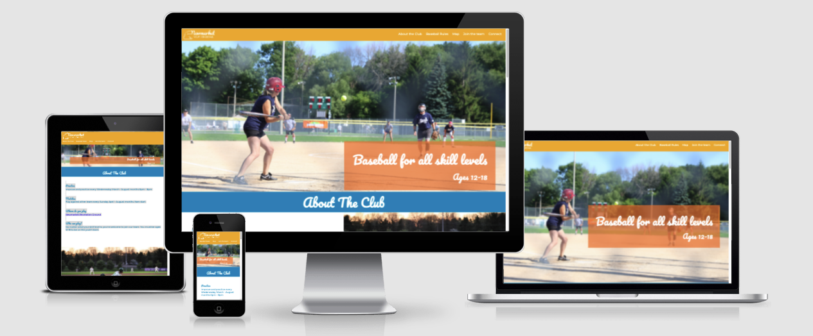
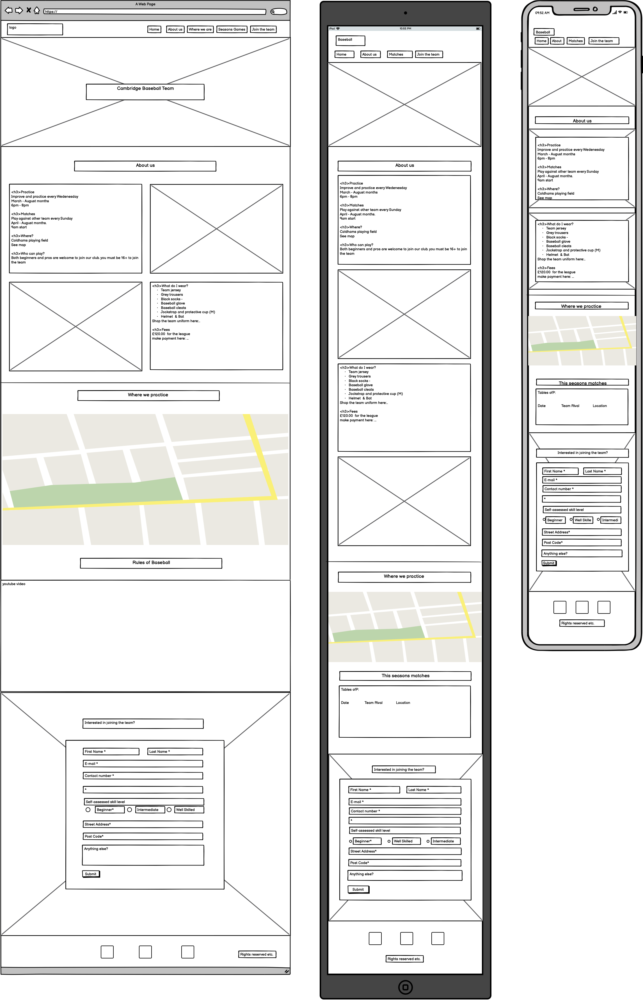

# Newmarket Youth Baseball

This website is designed to inform used base in and around the newmarket area of the Newmarket Youth Baseball team. The website is designed to inform users of the expectations of where to practice and play, explain kit requirements and fees, as well as inform the user of where practices take place. There is no skill elvel requied to join the team, so the website is designed to include all skill levels.

***

## Mockup
Before starting the website in github, the website was first mocked up in Wireframes. This ensured that there was a structure to refer to, content could be edited and a structure mock up of the different media queries could be created. 
Below you will see the wireframe used to refer to when the website was being coded.

You will see that along the coding process, the basic layout and content has been used. Along the way, there were changes made.

### Removals
I removed and replaced the Seasons games section. As the purpose of the website was to encourage players of all skill levels were welcome to join the team, I decided to include a recourse in the format of a video. This video explained th rules of the game and I felt this was a stronger use of the space for the purpose of the website. 
Once the video was included in the website, it was moved to be placed under the "about" section. This way, the user is informed of the game and then has the option to learn more about the club. 

I also removed the Home button the in the navigation. As the website is one streamlined page, it was a waste of headers space. The logo directs to the top of the page. 

### Edits
The layout of the form is a litle different to the wireframe. 

In the footer of the website, i moved the reserved text to be placed underneath the social media links. This created a stronger story of the website.  An addiitonal social media link was also added.

### Additions
I added subheadings to all the sections to enhance user readability of the website and to create a stronger flow of the website.

### Colours
Adobe color was used to find a colour pallet that would work for the young sporty feel for the team. The sharp colours were chosed to represent the youth players and the sport focus. 
These colours (with the additional of white) were used throughout the website to create a consistance and creative look.  

***
## Features
The website includes a variety of features both interactive and stagnent. 

### Navigation bar
The navigation bar sticks to the top of the page no matter how far down you scroll so you are always able to access different sections of the page
The navigations bar includes links to the top of the page, About the Club, Baseball Rules,  Map, Join the team and Connect. 
The navigation is crutial for the user to jump to different information quickly without having to scroll backwards and forwards. 

### Hero-image
The image is captivating and clear. It directly speaks that the website is for a youth baseball team. 
The cover text placed on top of the image educates the user of the primary aim for the team. Youth players, at all skill levels are welcome. 

### About the Club
This section allows users to learn more about the club. It includes expectations of practice and game times, as well as kit requirements and season fees. 
There is an internal link to the map further down in the page as well as an external link to paypal (opening in a new tab) to allow the user to make payment there and then. 
This section of the page is designed to educate the user directly about club information.

### Baseball Rules
The club is for all skill levels. It became apparent that there needed to be recourses available for new members who may need to understnad the rules for the first time, or for participating members to have a refresher. 
The video plays within the page at the users control. 
This is a very educational section of the website.

### Where to Find Us
As this is a local team, it was important for the user to understand the location of where the team practices and plays matches. The google map has been embeded so the user can control the map internally to the website without having to search the location up on an external wesbite/app.

### Join the Team
The form created is designed to gain information from the user of new team members. The basic contact information is requested and teh address information was relavant as this is a local team. The form was designed to be inviting and clear of the information required to join the team. 

### Connect
The social media links are a direct way that the user can be linked externally to the teams social media channels and youtube page. 

## Testing

## Validator Testing

## Depolyment

## Credits

